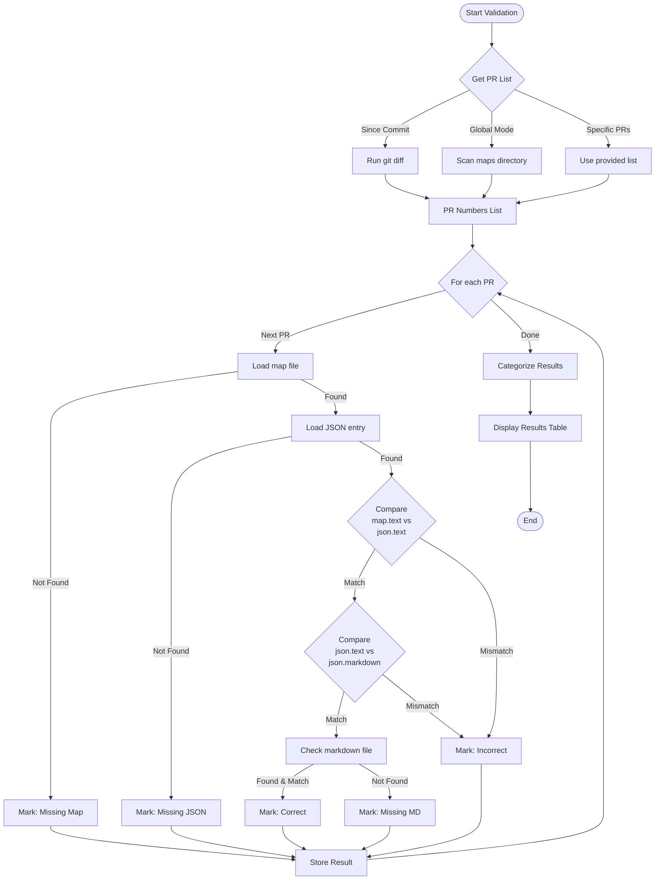
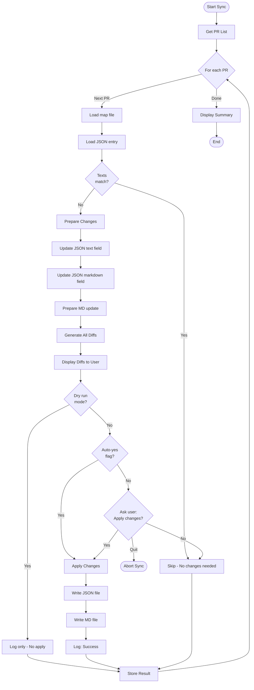
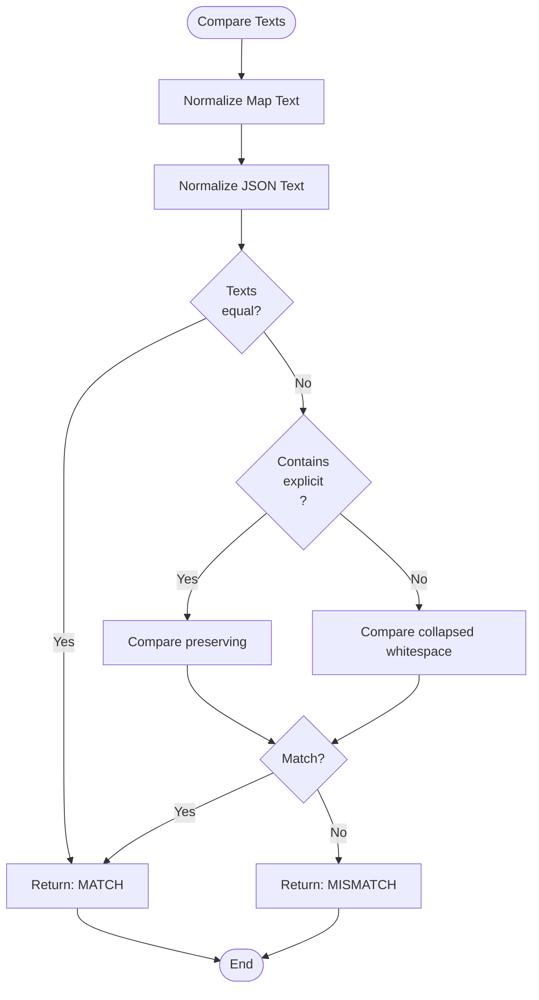

# Release Notes Sync Tool - Implementation Guide

## Detailed Algorithms & Pseudocode

### 1. Text Normalization Algorithm

```python
def normalize_yaml_text(yaml_text: str) -> str:
    """
    Normalize YAML text for comparison with JSON

    YAML multi-line strings are collapsed unless they contain \n
    Example:
      text: This is line one
        and line two
    Becomes: "This is line one and line two"

    But:
      text: This is line one\nand line two
    Stays: "This is line one\nand line two"
    """
    # Strip leading/trailing whitespace
    text = yaml_text.strip()

    # Collapse whitespace (spaces, tabs, newlines) to single space
    # UNLESS it's an escaped \n which should be preserved
    text = re.sub(r'\s+', ' ', text)

    return text


def extract_text_from_markdown(markdown_field: str) -> str:
    """
    Extract the descriptive text from a markdown field

    Input: "Fixed a bug... ([#123456](url), [@author](url)) [SIG Apps]"
    Output: "Fixed a bug..."
    """
    # Match everything before the first PR link pattern
    pattern = r'^(.*?)\s*\(\[#\d+\]'
    match = re.match(pattern, markdown_field)

    if match:
        return match.group(1).strip()

    # Fallback: return entire field if pattern not found
    return markdown_field.strip()


def texts_match(text1: str, text2: str) -> bool:
    """
    Compare two texts for equivalence after normalization
    """
    return normalize_yaml_text(text1) == normalize_yaml_text(text2)
```

### 2. Git Integration Algorithm

```python
def get_changed_map_files(commit_id: str, release_version: str) -> list[str]:
    """
    Get list of changed map files since a specific commit

    Steps:
    1. Use git diff to find changed files
    2. Filter for map files only
    3. Return list of PR numbers
    """
    release_dir = f"releases/release-{release_version}"
    maps_dir = f"{release_dir}/release-notes/maps"

    # Run: git diff --name-only <commit_id> HEAD -- <maps_dir>
    cmd = ['git', 'diff', '--name-only', commit_id, 'HEAD', '--', maps_dir]
    result = subprocess.run(cmd, capture_output=True, text=True)

    changed_files = result.stdout.strip().split('\n')

    # Filter out non-map files and extract PR numbers
    pr_numbers = []
    for file_path in changed_files:
        if file_path and file_path.endswith('-map.yaml'):
            # Extract PR number from filename: pr-123456-map.yaml
            match = re.search(r'pr-(\d+)-map\.yaml$', file_path)
            if match:
                pr_numbers.append(match.group(1))

    return pr_numbers
```

### 3. Validation Algorithm

```python
def validate_pr(pr_number: str, release_dir: str) -> dict:
    """
    Validate consistency of a single PR across all files

    Returns validation result with status and details
    """
    result = {
        'pr_number': pr_number,
        'map_exists': False,
        'json_exists': False,
        'md_exists': False,
        'map_text': None,
        'json_text': None,
        'json_markdown': None,
        'md_line': None,
        'map_json_match': False,
        'json_md_match': False,
        'status': 'unknown'
    }

    # Step 1: Load map file
    map_file = f"{release_dir}/release-notes/maps/pr-{pr_number}-map.yaml"
    if not os.path.exists(map_file):
        result['status'] = 'missing_map'
        return result

    result['map_exists'] = True
    with open(map_file, 'r') as f:
        map_data = yaml.safe_load(f)
        result['map_text'] = map_data['releasenote']['text']

    # Step 2: Load JSON file
    json_file = f"{release_dir}/release-notes/release-notes-draft.json"
    with open(json_file, 'r') as f:
        json_data = json.load(f)

    if pr_number not in json_data:
        result['status'] = 'missing_json'
        return result

    result['json_exists'] = True
    json_entry = json_data[pr_number]
    result['json_text'] = json_entry.get('text', '')
    result['json_markdown'] = json_entry.get('markdown', '')

    # Step 3: Compare map text with JSON text
    result['map_json_match'] = texts_match(
        result['map_text'],
        result['json_text']
    )

    # Step 4: Extract text from JSON markdown field and compare
    json_md_text = extract_text_from_markdown(result['json_markdown'])
    result['json_md_match'] = texts_match(
        result['json_text'],
        json_md_text
    )

    # Step 5: Check markdown file
    md_file = f"{release_dir}/release-notes/release-notes-draft.md"
    with open(md_file, 'r') as f:
        md_content = f.read()

    # Find the PR entry in markdown (search for the markdown field content)
    if result['json_markdown'] in md_content:
        result['md_exists'] = True
        result['md_line'] = result['json_markdown']
    else:
        result['status'] = 'missing_md'
        return result

    # Step 6: Determine overall status
    if result['map_json_match'] and result['json_md_match']:
        result['status'] = 'correct'
    else:
        result['status'] = 'incorrect'

    return result


def validate_all_prs(release_dir: str, pr_numbers: list[str] = None) -> dict:
    """
    Validate multiple PRs and categorize results
    """
    if pr_numbers is None:
        # Get all map files in directory
        maps_dir = f"{release_dir}/release-notes/maps"
        map_files = glob.glob(f"{maps_dir}/pr-*-map.yaml")
        pr_numbers = []
        for f in map_files:
            match = re.search(r'pr-(\d+)-map\.yaml$', f)
            if match:
                pr_numbers.append(match.group(1))

    results = {
        'correct': [],
        'incorrect': [],
        'missing_json': [],
        'missing_md': [],
        'errors': []
    }

    for pr_num in pr_numbers:
        try:
            validation = validate_pr(pr_num, release_dir)

            if validation['status'] == 'correct':
                results['correct'].append(validation)
            elif validation['status'] == 'incorrect':
                results['incorrect'].append(validation)
            elif validation['status'] == 'missing_json':
                results['missing_json'].append(validation)
            elif validation['status'] == 'missing_md':
                results['missing_md'].append(validation)
        except Exception as e:
            results['errors'].append({
                'pr_number': pr_num,
                'error': str(e)
            })

    return results
```

### 4. Sync Algorithm

```python
def sync_pr(pr_number: str, release_dir: str, auto_approve: bool = False) -> dict:
    """
    Sync a single PR from map file to JSON and markdown

    Returns sync result with changes applied
    """
    result = {
        'pr_number': pr_number,
        'changes_made': False,
        'json_updated': False,
        'md_updated': False,
        'user_approved': False,
        'diffs': []
    }

    # Step 1: Load map file (source of truth)
    map_file = f"{release_dir}/release-notes/maps/pr-{pr_number}-map.yaml"
    with open(map_file, 'r') as f:
        map_data = yaml.safe_load(f)
        new_text = map_data['releasenote']['text']

    # Step 2: Load JSON file
    json_file = f"{release_dir}/release-notes/release-notes-draft.json"
    with open(json_file, 'r') as f:
        json_data = json.load(f)

    if pr_number not in json_data:
        raise Exception(f"PR {pr_number} not found in JSON file")

    json_entry = json_data[pr_number]
    old_json_text = json_entry['text']
    old_json_markdown = json_entry['markdown']

    # Step 3: Check if changes needed
    if texts_match(new_text, old_json_text):
        result['changes_made'] = False
        return result

    # Step 4: Prepare changes
    # Update JSON text field
    new_json_text = new_text

    # Update JSON markdown field (preserve metadata)
    new_json_markdown = update_markdown_text_portion(
        old_json_markdown,
        new_text
    )

    # Generate diffs
    result['diffs'].append({
        'type': 'json_text',
        'old': old_json_text,
        'new': new_json_text,
        'diff': generate_diff(old_json_text, new_json_text)
    })

    result['diffs'].append({
        'type': 'json_markdown',
        'old': old_json_markdown,
        'new': new_json_markdown,
        'diff': generate_diff(old_json_markdown, new_json_markdown)
    })

    # Step 5: Load markdown file and prepare change
    md_file = f"{release_dir}/release-notes/release-notes-draft.md"
    with open(md_file, 'r') as f:
        md_content = f.read()

    # Replace old markdown line with new one
    new_md_content = md_content.replace(old_json_markdown, new_json_markdown)

    result['diffs'].append({
        'type': 'markdown_file',
        'old': old_json_markdown,
        'new': new_json_markdown,
        'diff': generate_diff(old_json_markdown, new_json_markdown)
    })

    # Step 6: Show diffs to user and get approval
    if not auto_approve:
        print(f"\n{'='*60}")
        print(f"Syncing PR #{pr_number}")
        print(f"{'='*60}\n")

        for i, diff_info in enumerate(result['diffs'], 1):
            print(f"[DIFF {i}/{len(result['diffs'])}] {diff_info['type']}:")
            print(diff_info['diff'])
            print()

        response = input("Apply these changes? [y/n/q]: ").lower()

        if response == 'q':
            raise KeyboardInterrupt("User quit")
        elif response != 'y':
            result['user_approved'] = False
            return result

    result['user_approved'] = True

    # Step 7: Apply changes
    # Update JSON
    json_entry['text'] = new_json_text
    json_entry['markdown'] = new_json_markdown

    with open(json_file, 'w') as f:
        json.dump(json_data, f, indent=2)
    result['json_updated'] = True

    # Update Markdown
    with open(md_file, 'w') as f:
        f.write(new_md_content)
    result['md_updated'] = True

    result['changes_made'] = True

    return result


def update_markdown_text_portion(old_markdown: str, new_text: str) -> str:
    """
    Update the text portion of a markdown field while preserving metadata

    Input: "Old text ([#123](url), [@author](url)) [SIG Apps]"
    Output: "New text ([#123](url), [@author](url)) [SIG Apps]"
    """
    # Find where the PR link starts
    match = re.search(r'\s*(\(\[#\d+\].*)$', old_markdown)

    if match:
        metadata = match.group(1)
        return f"{new_text} {metadata}"

    # Fallback: couldn't find pattern, return text as-is
    # This shouldn't happen in well-formed data
    return new_text


def generate_diff(old_text: str, new_text: str) -> str:
    """
    Generate a unified diff view between old and new text
    """
    old_lines = old_text.split('\n')
    new_lines = new_text.split('\n')

    diff = difflib.unified_diff(
        old_lines,
        new_lines,
        lineterm='',
        fromfile='OLD',
        tofile='NEW'
    )

    return '\n'.join(diff)
```

### 5. Main CLI Logic

```python
def main():
    """Main entry point for the CLI tool"""
    parser = argparse.ArgumentParser(
        description='Kubernetes Release Notes Sync Tool'
    )

    subparsers = parser.add_subparsers(dest='command', required=True)

    # Validate command
    validate_parser = subparsers.add_parser('validate')
    validate_parser.add_argument('--release', required=True)
    validate_parser.add_argument('--since-commit')
    validate_parser.add_argument('--global', action='store_true', dest='global_mode')
    validate_parser.add_argument('--output', choices=['table', 'json', 'csv'], default='table')

    # Sync command
    sync_parser = subparsers.add_parser('sync')
    sync_parser.add_argument('--release', required=True)
    sync_parser.add_argument('--since-commit')
    sync_parser.add_argument('--prs')
    sync_parser.add_argument('--global', action='store_true', dest='global_mode')
    sync_parser.add_argument('--auto-yes', action='store_true')
    sync_parser.add_argument('--dry-run', action='store_true')

    args = parser.parse_args()

    # Construct release directory path
    release_dir = f"releases/release-{args.release}"

    if not os.path.exists(release_dir):
        print(f"Error: Release directory not found: {release_dir}")
        sys.exit(1)

    # Get PR numbers to process
    if hasattr(args, 'prs') and args.prs:
        pr_numbers = args.prs.split(',')
    elif args.since_commit:
        pr_numbers = get_changed_map_files(args.since_commit, args.release)
        print(f"Found {len(pr_numbers)} changed map files since commit {args.since_commit}")
    elif args.global_mode:
        pr_numbers = None  # Will get all maps
    else:
        print("Error: Must specify --since-commit, --prs, or --global")
        sys.exit(1)

    # Execute command
    if args.command == 'validate':
        results = validate_all_prs(release_dir, pr_numbers)
        display_validation_results(results, args.output)

    elif args.command == 'sync':
        if args.dry_run:
            print("DRY RUN MODE - No changes will be applied\n")

        sync_results = []
        for pr_num in pr_numbers or get_all_pr_numbers(release_dir):
            try:
                result = sync_pr(
                    pr_num,
                    release_dir,
                    auto_approve=args.auto_yes or args.dry_run
                )
                sync_results.append(result)
            except KeyboardInterrupt:
                print("\nSync cancelled by user")
                break
            except Exception as e:
                print(f"Error syncing PR {pr_num}: {e}")

        display_sync_summary(sync_results)
```

## Flowcharts

### Validation Flow



### Sync Flow



### Text Comparison Logic



## Edge Cases & Error Handling

### Edge Case 1: Multi-line YAML with Explicit \n

**Input (map file)**:
```yaml
text: Line one\nLine two
  continues here
```

**Expected Behavior**:
- YAML parser reads as: `"Line one\nLine two continues here"`
- JSON text should be: `"Line one\nLine two continues here"`
- Markdown renders as: `"Line one<br>Line two continues here"`

**Handling**: Preserve `\n` escape sequences, collapse natural line breaks

### Edge Case 2: Missing JSON Entry

**Scenario**: Map file exists but PR not in JSON

**Handling**:
- Validation: Report as "Missing in JSON"
- Sync: Error - cannot sync without base entry
- Suggestion: User must add entry manually first

### Edge Case 3: Corrupted YAML

**Scenario**: Map file has invalid YAML syntax

**Handling**:
```python
try:
    map_data = yaml.safe_load(f)
except yaml.YAMLError as e:
    print(f"Error parsing {map_file}: {e}")
    result['status'] = 'error_yaml'
    result['error'] = str(e)
    return result
```

### Edge Case 4: Text with Backticks

**Input**: `` text: Fixed `kubectl` command ``

**Expected**: Backticks preserved in all formats

**Handling**: No special processing needed - treated as regular characters

### Edge Case 5: Very Long Text

**Scenario**: Text > 1000 characters

**Handling**:
- Show truncated diff (first 500 + last 500 chars)
- Full text still applied
- Warning: "Diff truncated for display"

### Edge Case 6: Concurrent Modifications

**Scenario**: Files modified during sync operation

**Handling**:
```python
# Before sync: Check file timestamps
initial_mtime = os.path.getmtime(json_file)

# After sync: Verify no external changes
current_mtime = os.path.getmtime(json_file)
if current_mtime != initial_mtime:
    raise Exception("File was modified during sync. Aborting.")
```

### Edge Case 7: Empty Map Text

**Scenario**: `text: ""`

**Handling**:
- Validation: Report as invalid
- Sync: Skip with warning
- Rationale: Empty release notes don't make sense

### Edge Case 8: Special Characters in Text

**Input**: `text: Fixed "bug" in 'code' & tests`

**Expected**: Quotes and ampersands preserved

**Handling**: No escaping needed - YAML/JSON handle automatically

## Testing Strategy

### Unit Tests

```python
# test_normalization.py
def test_normalize_multiline_yaml():
    input_text = "Line one\n  and line two"
    expected = "Line one and line two"
    assert normalize_yaml_text(input_text) == expected

def test_preserve_explicit_newlines():
    input_text = "Line one\\nLine two"
    expected = "Line one\\nLine two"
    assert normalize_yaml_text(input_text) == expected

# test_markdown_extraction.py
def test_extract_text_from_markdown():
    input_md = "Fixed bug ([#123](url), [@user](url)) [SIG Apps]"
    expected = "Fixed bug"
    assert extract_text_from_markdown(input_md) == expected

# test_comparison.py
def test_texts_match_after_normalization():
    text1 = "Line one\n  and two"
    text2 = "Line one and two"
    assert texts_match(text1, text2) == True
```

### Integration Tests

```python
# test_validation.py
def test_validate_correct_pr():
    result = validate_pr("123456", "test-data/release-1.35")
    assert result['status'] == 'correct'

def test_validate_incorrect_pr():
    result = validate_pr("789012", "test-data/release-1.35")
    assert result['status'] == 'incorrect'

# test_sync.py
def test_sync_updates_json():
    result = sync_pr("123456", "test-data/release-1.35", auto_approve=True)
    assert result['json_updated'] == True

    # Verify JSON was actually updated
    with open("test-data/release-1.35/release-notes/release-notes-draft.json") as f:
        json_data = json.load(f)
        assert json_data['123456']['text'] == expected_text
```

## Performance Considerations

### Memory Usage
- Process one PR at a time
- Don't load entire markdown file into memory multiple times
- Use generators for PR list iteration

### File I/O Optimization
```python
# Instead of: Read JSON for each PR
# Do: Read once, cache in memory

json_cache = None

def get_json_data(json_file):
    global json_cache
    if json_cache is None:
        with open(json_file) as f:
            json_cache = json.load(f)
    return json_cache
```

### Batch Processing
- Group multiple PRs into single JSON write
- Only write files once after all approvals

## Summary

This implementation guide provides:
- ✅ Detailed pseudocode for all core functions
- ✅ Visual flowcharts for main workflows
- ✅ Comprehensive edge case handling
- ✅ Testing strategy with examples
- ✅ Performance optimization tips

Next step: Switch to Code mode to implement this design!
